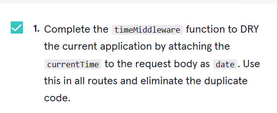

          


<a type="button" title="Codecademy_Learn_Express_Course_button" href="https://www.codecademy.com/courses/learn-express/lessons/express-code-challenges/exercises/code-challenge-drying-with-functions" target="_blank" data-CodecademyLearnExpressCourseButt="CodecademyLearnExpressCourseButt_data"></a>

<br><br>

# Express Middleware Code Challenges
<br>

# 1. Introduction:

<br>
<br>

# 2. Output:
> 

<br>
<br>

# 3. Prompts:

```js
const express = require('express');
const app = express();

// Finish this function and use it in the routes below
const sendFruitResponse = (req, res, next) => {
   res.send('fruit');
};

app.get('/whatis/apple', sendFruitResponse);

app.get('/whatis/orange', sendFruitResponse);

app.get('/whatis/banana', sendFruitResponse);

```


```js
const express = require('express');
const app = express();

const moods = ['happy', 'exuberant', 'fanatical about middleware'];

const moodleware = (req, res, next) => {
  const randomMoodIndex = Math.floor(Math.random() * moods.length);
  req.mood = moods[randomMoodIndex];
  next();
}

app.use(moodleware);

app.get('/randomMood', (req, res, next) => {
  res.send(req.mood);
});

```


```js
const express = require('express');
const app = express();

const database = {
  snacks: ['chips', 'apple', 'cookies'],
  sides: ['beans and rice', 'cole slaw', 'broccoli'],
  appetizers: ['oysters', 'dumplings', 'smoked almonds'],
};

// Add your code here:
const timeMiddleware = (req,res,next) => {
  const currentTime = Date.now();
  req.date = currentTime;
  next();
};

app.get('/snacks',timeMiddleware, (req, res, next) => {
  res.send(`Snacks as of ${req.date}: ${database.snacks}`);
});

app.get('/sides',timeMiddleware, (req, res, next) => {
  res.send(`Sides as of ${req.date}: ${database.sides}`);
});

app.get('/appetizers',timeMiddleware, (req, res, next) => {
  res.send(`Appetizers as of ${req.date}: ${database.appetizers}`);
});

```


```js
const express = require('express');
const app = express();

const foods = ['pasta carbonara', 'bánh mì', 'cucumber salad'];

app.get('/foods/:index', (req, res, next) => {
  if (foods[req.params.index]) {
    res.send(req.params.index);
  } else {
    const err = Error('Invalid index!');
    err.status = 404;
    next(err);
  }
});

const errorHandler = (err,req,res,next) => {
  let status = err.status || 500;
  res.status(status).send(err.message);
};

app.use(errorHandler);

```


```js
const express = require('express');
const app = express();
// Add your code below:
const morgan = require("morgan");

// Add your code above
app.use(morgan("short"));
app.get('/say-hi', (req, res, next) => {
  res.send('Hi!');
});

app.get('/say-bye', (req, res, next) => {
  res.send('Bye!');
});

```


```js
const express = require('express');
const app = express();

const data = [1, 2, 3, 4, 5];

const indexExists = (req, res, next) => {
  const index = req.params.index;
  if (data[index]) {
    next();
  } else {
    res.status(404).send();
  }
};

// Add your code below:
app.use(indexExists);


// Add your code above
app.use("/data/:index",indexExists);

app.get('/data/:index', (req, res, next) => {
  res.send(data[req.params.index]);
});

app.put('/data/:index', (req, res, next) => {
  data[req.params.index] = req.body.number;
  res.send(data[req.params.index]);
});

app.delete('/data/:index', (req, res, next) => {
  data.splice(req.params.index, 1);
  res.status(204).send();
});

app.get('/', (req, res, next) => {
  res.send(data);
});

```


```js
const express = require('express');
const app = express();
const cors = require("cors");
app.use(cors());

```

```js
const express = require('express');
const app = express();

const secretData = {
  adminUsers: ['1', '2', '51'],
  coolPhoneNumbers: ['555-555-CODE', '555-EXP-RESS', 'MID-DLE-WARE'],
  favSites: ['codecademy.com', 'expressjs.com']
}

const publicData = {
  colors: ['green', 'orange'],
  numbers: [1, 2, 3, 4, 5]
}

const isAdmin = (req, res, next) => {
  const id = req.params.userId;
  if (!secretData.adminUsers.includes(id)) {
    res.status(401).send(); // Unauthorized
  } else {
    next();
  }
}

app.get('/:userId/colors', (req, res, next) => {
  res.send(publicData.colors);
});

app.get('/:userId/numbers', (req, res, next) => {
  res.send(publicData.numbers);
});

app.get('/:userId/phone-numbers',isAdmin, (req, res, next) => {
  res.send(secretData.coolPhoneNumbers);
});

app.get('/:userId/fav-sites',isAdmin, (req, res, next) => {
  res.send(secretData.favSites);
});

```

```js
const express = require('express');
const appleRouter = express.Router();

const apples = {
  mcintosh: {
    description: 'Classic, juicy, bright',
    priceRange: 'medium',
    color: 'green and red'
  },
  honeycrisp: {
    description: 'Crisp, sweet!',
    priceRange: 'pricey',
    color: 'red and yellow'
  },
  goldenDelicious: {
    description: 'rich, custardy',
    priceRange: 'cheap',
    color: 'yellow'
  }
}

appleRouter.param('variety', (req, res, next, variety) => {
  if (!apples[variety]) {
    res.status(404).send();
  } else {
    req.variety = apples[variety];
    next();
  }
});

appleRouter.get('/:variety/description', (req, res, next) => {
  res.send(req.variety.description);
});

appleRouter.get('/:variety/price-range', (req, res, next) => {
  res.send(req.variety.priceRange);
});

appleRouter.get('/:variety/color', (req, res, next) => {
  res.send(req.variety.color);
});
```