          


<a type="button" title="Codecademy_Learn_Express_Course_button" href="https://www.codecademy.com/courses/learn-express/lessons/learn-express-routes-code-challenge/exercises/code-challenge-express" target="_blank" data-CodecademyLearnExpressCourseButt="CodecademyLearnExpressCourseButt_data"></a>

<br><br>

# Express Routes Code Challenge
<br>

# 1. Introduction:
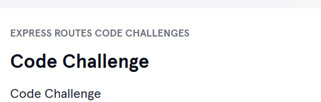
<br>
<br>

# 2. Output:
> 

<br>
<br>

# 3. Prompts:
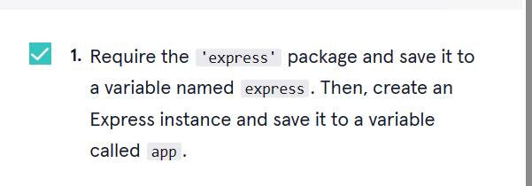
```js
const express = require("express")
const app = express()

```

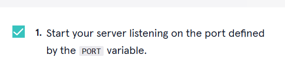
```js
const express = require('express');

const app = express();

const PORT = process.env.PORT || 4001;

// Add your code below:
app.listen(PORT, ()=>{
  console.log("Server is running on port: "+PORT);
})

```

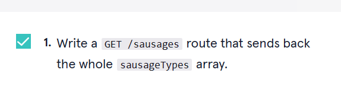
```js
const express = require('express');
const app = express();

const PORT = process.env.PORT || 4001;

const sausageTypes = ['bratwurst', 'andouille', 'chorizo', 'boudin', 'kielbasa'];

app.get("/sausages",(req,res,next)=>{
  res.send(sausageTypes);
});

app.listen(PORT, () => {
  console.log(`Server is listening on port ${PORT}`);
});


```

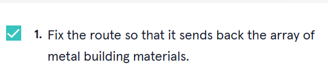
```js
const express = require('express');
const app = express();

const PORT = process.env.PORT || 4001;

const buildingMaterials = {
  wood: ['plywood', '2x4s', 'cedar shingles'],
  metal: ['steel girders', 'wall studs', 'rebar'],
};

app.listen(PORT, () => {
  console.log(`Server is listening on port ${PORT}`);
});

app.get('/metals', (req, res, next) => {
  const arrayToSend = buildingMaterials.metal;
  res.send(arrayToSend);

});

```

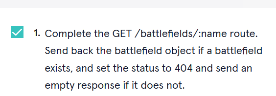
```js
const express = require('express');
const app = express();

const PORT = process.env.PORT || 4001;

const battlefields = {
  fortSumter: {
    state: 'SC',
  },
  manassas: {
    state: 'VA',
  },
  gettysburg: {
    state: 'PA',
  },
  antietam: {
    state: 'MD',
  }
}

app.listen(PORT, () => {
  console.log(`Server is listening on port ${PORT}`);
});

app.get('/battlefields/:name', (req, res, next) => {
  const battlefieldName = req.params.name;
  if(battlefields[battlefieldName]){
    res.send(battlefields[battlefieldName]);
  }else{
    res.status(404).send();
  }
  
});

```

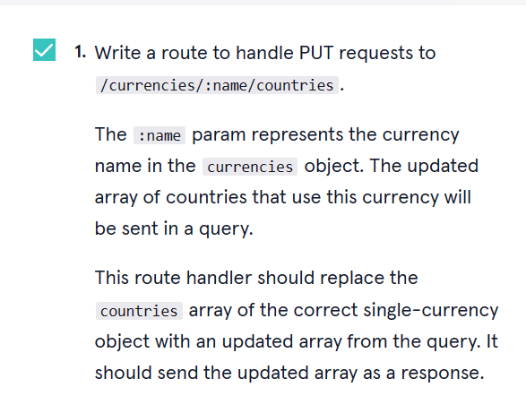
```js
const express = require('express');
const app = express();

const PORT = process.env.PORT || 4001;

const currencies = {
  diram: {
    countries: ['UAE', 'Morocco'],
  },
  real: {
    countries: ['Brazil'],
  },
  dinar: {
    countries: ['Algeria', 'Bahrain', 'Jordan', 'Kuwait'],
  },
  vatu: {
    countries: ['Vanuatu'],
  },
  shilling: {
    countries: ['Tanzania', 'Uganda', 'Somalia', 'Kenya'],
  },
};

app.put("/currencies/:name/countries",(req,res,next)=>{
 const currencyName = req.params.name;
  const countries = req.query;
  currencies[currencyName] = countries;
  res.send(currencies[currencyName]);
});

app.listen(PORT, () => {
  console.log(`Server is listening on port ${PORT}`);
});


```

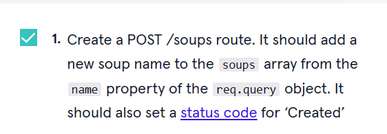
```js
const express = require('express');
const app = express();

const PORT = process.env.PORT || 4001;

const soups = ['gazpacho', 'borscht', 'primordial', 'avgolemono', 'laksa'];

app.post("/soups",(req,res,next)=>{
  const name = req.query.name;
  soups.push(name);
  res.status(201).send(name);
});

app.listen(PORT, () => {
  console.log(`Server is listening on port ${PORT}`);
});


```

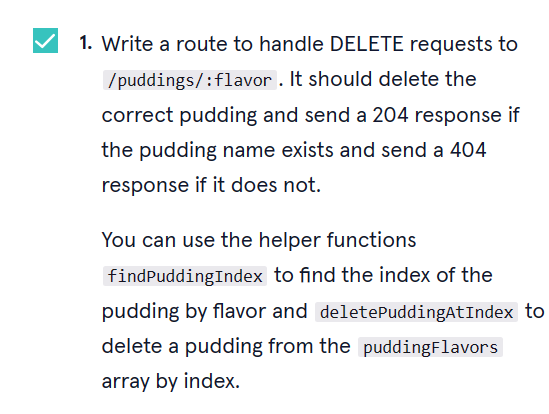
```js
const express = require('express');
const app = express();

const PORT = process.env.PORT || 4001;

const puddingFlavors = ['chocolate', 'banana', 'butterscotch', 'pistachio'];

const findPuddingIndex = (name) => {
  return puddingFlavors.indexOf(name);
}

const deletePuddingAtIndex = (index) => {
  puddingFlavors.splice(index, 1);
}

// Your code here!
app.delete("/puddings/:flavor",(req,res,next)=>{
  let puddingIndex = findPuddingIndex(req.params.flavor);
  if(puddingIndex !== -1){
    deletePuddingAtIndex(puddingIndex);
    res.status(204).send();
  }else{
    res.status(404).send();
  }
});


app.listen(PORT, () => {
  console.log(`Server is listening on port ${PORT}`);
});


```

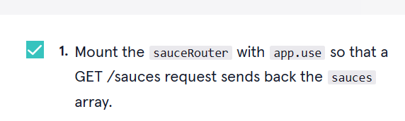
```js
const express = require('express');
const app = express();

const PORT = process.env.PORT || 4001;

app.listen(PORT, () => {
  console.log(`Server is listening on port ${PORT}`);
});

const pastas = ['agnolotti', 'cavatelli', 'gemelli', 'tortellini'];

app.get('/pastas', (req, res, next) => {
  res.send(pastas);
});

const sauceRouter = express.Router();
// Add your code here:
app.use("/sauces",sauceRouter);

const sauces = ['carbonara', 'primavera', 'bolognese', 'puttanesca', 'fra diavolo']

sauceRouter.get('/', (req, res, next) => {
  res.send(sauces);
});

```

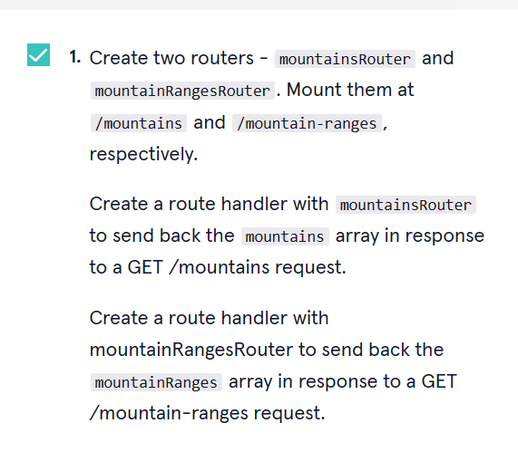
```js
const express = require('express');
const app = express();

const PORT = process.env.PORT || 4001;

const mountains = ['denali', 'olympus', 'kilimanjaro', 'matterhorn'];
const mountainRanges = ['alps', 'andes', 'himalayas', 'rockies'];

// Your code here
const mountainsRouter = express.Router();
const mountainRangesRouter = express.Router();

mountainsRouter.get('/', (req, res, next) => {
  res.send(mountains)
})

mountainRangesRouter.get('/', (req, res, next) => {
  res.send(mountainRanges)
})

app.use('/mountains', mountainsRouter)
app.use('/mountain-ranges', mountainRangesRouter)


app.listen(PORT, () => {
  console.log(`Server is listening on port ${PORT}`);
});
```


